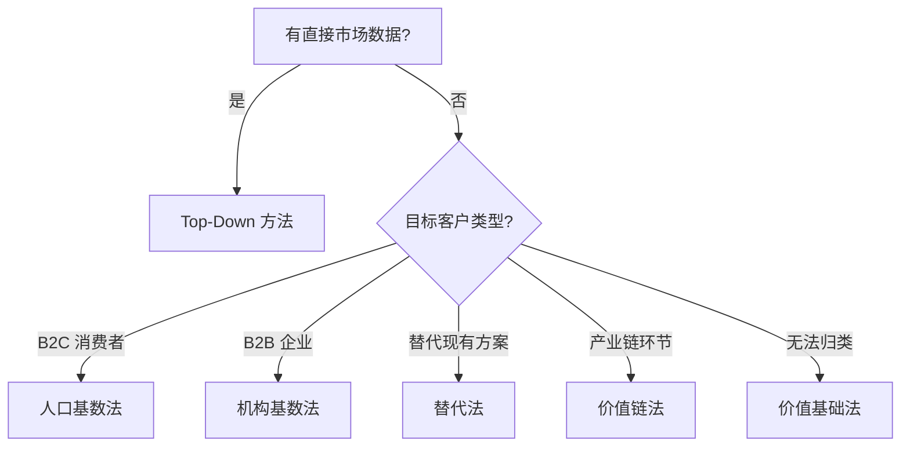

# Market Sizing Skill V2

专业级市场规模测算工具，支持 Fermi 估算、Monte Carlo 模拟和多数据源集成。

## 核心能力

| 能力 | 描述 |
|------|------|
| **Fermi 估算** | 5 种分解模式，结构化计算 |
| **Monte Carlo** | 输出置信区间，而非单点估计 |
| **数据 API** | 6 个免费数据源 (AkShare, FRED, World Bank 等) |
| **专业报告** | Markdown + HTML 交互图表 |

---

## 触发条件

当用户提到以下内容时触发：
- 「市场规模」「市场有多大」「market size」
- 「TAM」「SAM」「SOM」
- 「估算市场」「市场测算」
- 明确的市场定义请求

---

## 工作流程

### Phase 1: 信息收集 (必须先完成)

**在开始任何计算之前，必须收集以下信息**:

```markdown
## 🎯 Clarifying Questions

1. **市场定义**
   - 产品/服务的边界是什么？
   - 包含什么？排除什么？
   - 是否包含售后服务/MRO？

2. **客户画像**
   - 目标客户是谁？B2B 还是 B2C？
   - 企业规模/人口特征要求？

3. **地域范围**
   - 全球/区域/单一国家？
   - 是否含港澳台？

4. **时间范围**
   - 当前年份还是预测期？
   - 需要几年预测？

5. **数据可得性**
   - 用户有现成资料吗？
   - 是否有竞品信息？
```

**只有在收集完必要信息后，才能进入计算阶段。**

### Phase 2: 方法选择

根据数据可得性选择方法：



详细方法说明见 [fermi_patterns.md](references/fermi_patterns.md)。
如果已知行业类型 (SaaS/Marketplace/Consumer/B2B/Hardware)，优先参考 [industry_templates.md](references/industry_templates.md)。

### Phase 3: 数据获取

使用 `data_fetcher.py` 获取真实数据支撑假设：

```python
from scripts.data_fetcher import DataFetcher

df = DataFetcher()

# 中国 GDP
gdp = df.get_china_gdp()

# 行业数据
industry = df.search_akshare_functions("汽车")
```

详细 API 说明见 [data_sources.md](references/data_sources.md)。

### Phase 4: Fermi 计算

> 🚨 **数据三原则** (强制): 每一个数字只能是以下三种之一，不允许凭空出现任何数据:
> | 类型 | 标记 | 要求 |
> |------|------|------|
> | **引用** | 📚 | 来自可靠报告/公开数据，必须标注具体来源 (报告名+页码/URL) |
> | **计算** | 🧮 | 由已有数据推导得出，必须写出完整计算公式 |
> | **假设** | ⚠️ | 无法获取的合理估计，必须说明估计依据并给出范围 |

使用 `fermi_calculator.py` 执行结构化计算：

```python
from scripts.fermi_calculator import FermiCalculator

calc = FermiCalculator()

result = calc.population_based(
    base_population=1.4e9,
    filters=[
        ("城市人口", 0.65),
        ("20-50岁", 0.45),
        ("目标用户", 0.20),
    ],
    penetration_rate=0.8,
    average_spend=100,
    frequency=12,
    unit="元"
)

print(result)
```

### Phase 5: Monte Carlo 模拟

使用 `monte_carlo.py` 量化不确定性：

```python
from scripts.monte_carlo import MonteCarloSimulator, Assumption

sim = MonteCarloSimulator(seed=42)

result = sim.run(
    assumptions={
        "市场基数(亿)": Assumption(min=20, max=35, most_likely=25),
        "目标占比": Assumption(min=0.35, max=0.55, most_likely=0.45),
        "市占率": Assumption(min=0.10, max=0.20, most_likely=0.15),
    },
    formula=lambda **k: k["市场基数(亿)"] * k["目标占比"] * k["市占率"],
    n_simulations=10000,
    unit="亿元"
)

print(result)
# 输出 90% 置信区间和敏感性分析
```

### Phase 6: 生成报告

使用 `report_generator.py` 输出专业报告。报告格式选择见 [presentation_guide.md](references/presentation_guide.md)。

```python
from scripts.report_generator import ReportGenerator, MarketSizingData

gen = ReportGenerator()

data = MarketSizingData(
    market_name="中国航空活塞发动机 (200-500HP)",
    geography="中国大陆",
    base_year=2024,
    forecast_years=5,
    tam=25.5,
    sam=11.5,
    som=1.7,
    unit="亿元",
    cagr=0.08,
    monte_carlo_result=result.to_dict(),
)

gen.generate(data, output_dir="./output", formats=["md", "html", "xlsx"])
```

> [!IMPORTANT]
> **Excel 公式链依赖 `assumptions` 中的 `key` 字段命名**。必须遵循以下规范，否则 Excel 将降级为静态值。

#### Assumption Key 命名规范 (强制)

Excel 引擎通过 `key` 名自动检测 Fermi 分解模式并构建公式链。

**模式 1: 机构基数法 (institution_based)**

每个分段使用 `{prefix}_count` + `{prefix}_adopt` + `{prefix}_price` 三件套：

```python
# 段前缀可自由命名 (ka/mid/smb/enterprise/startup...)
# 引擎自动检测 *_count/*_vol + *_adopt/*_rate + *_price
{"key": "ka_count",  "numeric_value": 5000,   ...},
{"key": "ka_adopt",  "numeric_value": 0.85,   ...},
{"key": "ka_price",  "numeric_value": 150,    ...},
```

**模式 2: 人口基数法 (population_based)** — 使用固定 key 名：

| key | 含义 | 示例 |
|-----|------|------|
| `base_pop` | 基础人口 (亿人) | 9.3 |
| `core_pop_pct` | 核心人群占比 | 0.45 |
| `pene_rate` | 渗透率 | 0.65 |
| `freq` | 消费频次 | 45 |
| `price` | 单价 (元) | 5.5 |

**模式 3: 替代法 (substitution_based):**

| key | 含义 |
|-----|------|
| `existing_market` | 现有市场规模 |
| `substitution_rate` | 替代率 |
| `price_premium` | 价格系数 (可选, 默认 1.0) |

**模式 4: 价值链法 (value_chain_based):**

| key | 含义 |
|-----|------|
| `end_market` | 终端市场规模 |
| `value_share` | 环节价值占比 |

**模式 5: 价值基础法 (value_based):**

| key | 含义 |
|-----|------|
| `target_count` | 目标客户数 |
| `prob_freq` | 问题频率 (可选) |
| `prob_cost` | 单次问题成本 |
| `wtp_ratio` | 愿付比例 |

**通用 key (所有模式都需要):**

| key | 含义 | Excel 用途 |
|-----|------|-----------|
| `sam_ratio` | SAM/TAM 比例 | `SAM = TAM × sam_ratio` |
| `som_share` | 目标市占率 | `SOM = SAM × som_share` |
| `cagr` | 复合增长率 | Growth Forecast 公式 |

**`numeric_value` 规则:** 百分比/比率填小数 (0.85=85%)，金额单位与计算模型一致。

#### Assumption 字段模板 (每项必填)

```python
{
    "key": "ka_count",           # 🔴 必填 — 引擎用此构建公式
    "name": "KA机构数量",         # 🔴 必填 — 显示名
    "numeric_value": 5000,        # 🔴 必填 — 用于 Excel 计算
    "value": "5000家",            # 用于 MD/HTML 展示
    "source": "⚠️ 假设: ...",     # 🔴 必填 — 📚/🧮/⚠️ + 依据
    "type": "⚠️",                 # 🔴 必填 — 📚/🧮/⚠️
    "used_in": "Bottom-Up KA",    # 可选 — 标注使用环节
}
```

---

## 输出规范

### 交付物清单

1. **Markdown 报告** - 包含 Mermaid 图表，适合分享和存档
2. **HTML 报告** - 包含 Plotly 交互图表 (可选)，适合演示
3. **Excel 分析模型** - 5 个 Sheet (核心假设/TAM_SAM_SOM/Monte Carlo/竞争格局/增长预测)
4. **假设清单** - 每个假设必须标注类型 (📚/🧮/⚠️) 和来源

### 报告必含章节 (12 项)

- [ ] **执行摘要**: TAM/SAM/SOM/CAGR 卡片 + 核心洞察
- [ ] **市场边界定义**: 产品/地理/渠道/时间 4 维含排除表
- [ ] **核心假设清单**: 每项标注 📚引用/🧮计算/⚠️假设
- [ ] **Bottom-Up 分解**: 多层 Fermi 分解树 + 分层计算表
- [ ] **Top-Down 验证**: 行业报告→筛选→结果
- [ ] **交叉验证对比表**: 方法/结果/偏差
- [ ] **增长预测**: 年度预测表 + CAGR + 驱动力与风险
- [ ] **Monte Carlo 置信区间**: 假设分布表 + P5/P50/P95
- [ ] **敏感性分析**: Tornado 排序 + 解读与行动建议
- [ ] **竞争格局**: 主要玩家 + 市占率 + CR3集中度
- [ ] **风险与局限性**
- [ ] **数据来源汇总**


---

## 质量检查 (Sanity Check)

在完成分析后，**必须**进行以下检查：

### 🔴 强制项：交叉验证

任何市场规模估算都**必须**使用至少两种方法进行交叉验证：

| 方法组合 | 适用场景 |
|----------|----------|
| Top-Down + Bottom-Up | 最常用，大多数 B2C 市场 |
| 人口基数 + 机构基数 | 同时覆盖 B2C 和 B2B |
| 替代法 + 价值链法 | 新品类进入成熟市场 |

**验证标准**：
- 偏差 **<20%**: 合理，取加权平均或说明差异原因即可
- 偏差 **20-50%**: 需分析差异原因（口径不同？假设偏差？），调整后重新验证
- 偏差 **>50%**: 必须检查关键假设，可能存在根本性问题

> ⚠️ **禁止为了凑近偏差者而恶意调整假设**。偏差本身是信号，不是错误。如果两种方法差异很大，应该诚实报告并分析原因，而不是修改数字让它们“看起来一致”。

### 其他检查

1. **数量级验证**: 结果是否在合理范围内？
2. **对标检查**: 与已知类似市场相比是否合理？
3. **假设敏感性**: 哪些假设对结果影响最大？

---

## 常见错误

### 错误 1: 混淆 TAM 和 SAM
- ✘ 用整个市场作为自己的可触达市场
- ✔ TAM 是理论上限，SAM 要包含产品/地域/客群筛选

### 错误 2: SOM 过于激进
- ✘ 新进入者 5 年内声称能拿 10%+ 市场
- ✔ 新进入者通常 3 年 2-3%，5 年 5%，有网络效应的行业可更高

### 错误 3: 只用 Top-Down
- ✘ 仅引用行业报告数字，不做 Bottom-Up 验证
- ✔ Top-Down 只是起点，必须用 Bottom-Up 交叉验证

### 错误 4: 樱桃挑选数据
- ✘ 混用不同年份、不同口径的数据
- ✔ 保持数据源一致，明确标注年份和口径

### 错误 5: 忽视市场动态
- ✘ 把市场规模当作静态数字
- ✔ 必须考虑 CAGR、竞争格局变化、政策影响

---

## 文件结构

```
market-sizing/
├── SKILL.md                         # 本文件
├── references/
│   ├── methodology.md               # 方法论详解
│   ├── fermi_patterns.md            # Fermi 分解模式库 (含深度指南)
│   ├── industry_templates.md        # 行业特化模板 (SaaS/Marketplace/Consumer/B2B/Hardware)
│   ├── presentation_guide.md        # 呈现策略指南 (投资人 vs 战略)
│   ├── data_sources.md              # 数据源使用指南
│   └── prompts.md                   # 后续分析提示库
├── examples/
│   ├── tech_ai_dev_tools.md         # 完整案例: 科技 (AI 开发工具)
│   ├── consumer_prefab_food.md      # 完整案例: 消费 (预制菜)
│   └── software_finance_saas.md     # 完整案例: 软件 (财务 SaaS)
├── scripts/
│   ├── data_fetcher.py              # 数据 API 封装
│   ├── fermi_calculator.py          # Fermi 计算引擎
│   ├── monte_carlo.py               # Monte Carlo 模拟
│   └── report_generator.py          # 报告生成器
└── templates/
    ├── market_sizing_report.md      # Markdown 模板
    └── market_sizing_template.xlsx  # Excel 模板
```

---

## 依赖安装

```bash
pip install pandas numpy akshare baostock yfinance pytrends plotly openpyxl

# FRED 需要注册 API Key
pip install fredapi
# 设置环境变量 FRED_API_KEY

# World Bank
pip install wbdata
```

---

## 示例用法

**用户**: 估算中国咖啡市场规模

**AI 响应**:

1. 首先收集信息:
   - 市场定义: 现磨咖啡 + 即饮咖啡 + 速溶咖啡？
   - 地域: 中国大陆？
   - 时间: 2024 年现状？

2. 确认后选择人口基数法

3. 获取数据支撑假设

4. 执行 Fermi 计算 + Monte Carlo

5. 输出完整报告
