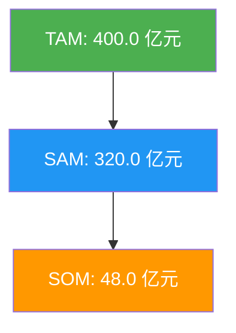

# 市场规模分析报告：中国宠物猫粮市场

> **市场**: 中国宠物猫粮市场
> **地域范围**: 中国大陆
> **基准年份**: 2024
> **分析日期**: 2026-02-09

---

## 执行摘要

| 指标 | 数值 | 说明 |
|------|------|------|
| **TAM** | 400.0 亿元 | 总可寻址市场 |
| **SAM** | 320.0 亿元 | 可服务市场 |
| **SOM** | 48.0 亿元 | 可获取市场 |
| **CAGR** | 18.0% | 预计复合增长率 |

### 市场层级

---

## Monte Carlo 模拟结果

**模拟次数**: 10,000

### 置信区间

| 分位数 | 数值 |
|--------|------|
| P5 (悲观) | 218.50 亿元 |
| P25 | 280.60 亿元 |
| **P50 (中位数)** | **318.20 亿元** |
| P75 | 358.40 亿元 |
| P95 (乐观) | 428.70 亿元 |

### 敏感性分析 (Tornado)

| 假设 | 影响幅度 |
|------|----------|
| 猫粮年消费(元/只) | ▓▓▓▓▓ +25.3% |
| 宠物猫数量(万只) | ▓▓ +11.8% |
| 商品粮渗透率 | ▓ +8.2% |

---

## 关键假设清单

| 假设项 | 数值 | 来源 | 置信度 |
|--------|------|------|--------|
| 宠物猫数量 | 7153万只 | 派读宠物白皮书2024 | 高 |
| 年均猫粮消费 | 560元/只 | 单猫消费2020元×28% | 中 |
| 商品粮渗透率 | 80% | 行业估算 | 中 |
| CAGR | 18% | 蝉妈妈报告 | 中 |

---

## 竞争格局

| 公司 | 市占率 | 优势 |
|------|--------|------|
| 皇家 Royal Canin | 5.9% | 品牌认知度高，精准营养 |
| 渴望 Orijen | 2.5% | 高端天然粮先行者 |
| 麦富迪 | 4.5% | 国产头部，性价比 |
| 网易严选 | 4.0% | 互联网渠道优势 |
| 蓝氏 | 2.9% | 差异化产品(乳鸽猫粮) |

---

## 数据来源

1. 派读宠物行业大数据《2025年中国宠物行业白皮书》
2. 毕马威《2025年中国宠物行业市场报告》
3. 蝉妈妈AI《2025年中国猫粮市场综合分析报告》
4. Euromonitor 宠物食品市场数据
