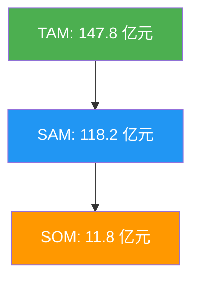
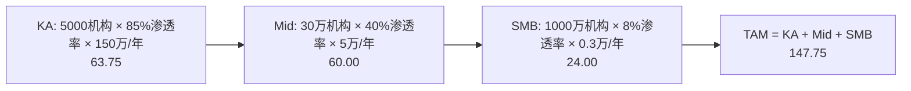

# 市场规模分析报告：中国AI客服软件市场

> **市场**: 中国AI客服软件市场
> **地域范围**: 中国大陆
> **基准年份**: 2024
> **分析日期**: 2026-02-12

---

## 执行摘要

| 指标 | 数值 | 说明 |
|------|------|------|
| **TAM** | 147.8 亿元 | 总可寻址市场 |
| **SAM** | 118.2 亿元 | 可服务市场 |
| **SOM** | 11.8 亿元 | 可获取市场 |
| **CAGR** | 22.6% | 预计复合增长率 |

**核心洞察**: 大模型技术爆发推动智能客服从'规则引擎'向'认知引擎'升级。中型企业客单价(影响24.4%)和KA客单价(14.4%)是两个最敏感变量。纯软件口径(不含通信费/硬件)下，市场规模约148亿元。

### 市场层级

---

## 市场边界定义

| 维度 | 包含 (In Scope) | 排除 (Out of Scope) |
|------|-----------------|---------------------|
| **产品** | 智能文本/语音机器人, 智能座席辅助, 智能质检 | 传统呼叫中心软件, 通信线路费, 纯人工外包 |
| **地域** | 中国大陆 | 港澳台 |
| **客户** | 全行业(金融/电商/政务/医疗等) | 个人开发者 |

---

## Fermi 估算分解

**方法**: N/A

**公式**: `N/A`

### 计算步骤

---

## Monte Carlo 模拟结果

**模拟次数**: 5,000

### 置信区间

| 分位数 | 数值 |
|--------|------|
| P5 (悲观) | 121.40 亿元 |
| P25 | 138.02 亿元 |
| **P50 (中位数)** | **150.93 亿元** |
| P75 | 164.73 亿元 |
| P95 (乐观) | 184.98 亿元 |

### 敏感性分析 (Tornado)

| 假设 | 影响幅度 |
|------|----------|
| mid_price | ▓▓▓▓ +24.4% |
| ka_price | ▓▓ +14.4% |
| mid_vol | ▓▓ +13.5% |
| smb_price | ▓▓ +10.8% |
| smb_vol | ▓ +8.1% |
| ka_vol | ▓ -7.6% |

---

## 核心假设清单

> 📚 = 引用可靠报告 | 🧮 = 由已有数据计算推导 | ⚠️ = 合理假设

| 假设项 | 数值 | 来源/推导 | 类型 |
|--------|------|-----------|------|
| KA机构数量 | 5000家 | ⚠️ 假设: 参考财富500强+央企名录估算 | ⚠️ |
| KA渗透率 | 85% | ⚠️ 假设: 头部企业IT预算充足,采纳率高 | ⚠️ |
| KA年均客单价 | 150万元/年 | ⚠️ 假设: 纯软件授权/订阅(不含实施) | ⚠️ |
| 腰部机构数量 | 30万家 | ⚠️ 假设: 参考规模以上服务业企业数 | ⚠️ |
| 腰部渗透率 | 40% | ⚠️ 假设: 中型企业渗透率30-50%取中值 | ⚠️ |
| 腰部年均客单价 | 5万元/年 | ⚠️ 假设: 参考SaaS高级版公开定价 | ⚠️ |
| 小微机构数量 | 1000万家 | ⚠️ 假设: 参考工商总局小微企业统计 | ⚠️ |
| 小微渗透率 | 8% | ⚠️ 假设: 小微企业AI工具渗透率极低 | ⚠️ |
| 小微年均客单价 | 0.3万元/年 | ⚠️ 假设: 参考SaaS入门版公开定价 | ⚠️ |
| 可服务比例 | 80% | ⚠️ 假设: 排除无信息化基础极小微企业 | ⚠️ |
| 目标市占率(3年) | 10% | ⚠️ 假设: 参考行业领先者市占率水平 | ⚠️ |
| CAGR | 22.6% | ⚠️ 假设: 参考IDC 2023-2028预测区间 | ⚠️ |

---

## 竞争格局

| 公司 | 市占率 | 优势 | 数据来源 |
|------|--------|------|----------|
| 阿里云 (通义千问) | 11.4% | 云生态+大模型能力 | 📚 IDC |
| 网易七鱼 | ~10% | 电商/客服场景深耕 | 📚 第一新声 |
| 腾讯企点 | ~8% | 微信社交连接能力 | ⚠️ 估算 |
| 智齿科技 | ~6% | 全渠道融合 | 📚 第一新声 |

---

## 增长预测

| 年份 | TAM | SAM | 增长率 |
|------|-----|-----|--------|
| 2024 | 147.75 | 118.2 | — |
| 2025 | 181.14 | 144.91 | 22.6% |
| 2026 | 222.08 | 177.66 | 22.6% |
| 2027 | 272.27 | 217.82 | 22.6% |
| 2028 | 333.8 | 267.04 | 22.6% |
| 2029 | 409.24 | 327.39 | 22.6% |

---

## 数据来源

1. 📚 IDC 中国智能客服市场份额报告 (2023)
2. 📚 第一新声 2024年中国智能客服市场研究报告
3. 📚 CCCS 中国客户中心产业发展报告
4. 📚 各厂商公开定价信息 (网易七鱼, 智齿, 腾讯企点)
