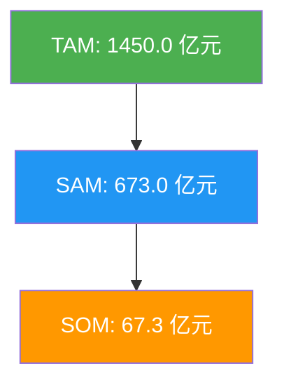
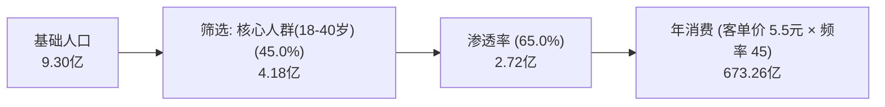

# 市场规模分析报告：中国无糖茶饮料市场

> **市场**: 中国无糖茶饮料市场
> **地域范围**: 中国大陆
> **基准年份**: 2024
> **分析日期**: 2026-02-10

---

## 执行摘要

| 指标 | 数值 | 说明 |
|------|------|------|
| **TAM** | 1450.0 亿元 | 总可寻址市场 |
| **SAM** | 673.0 亿元 | 可服务市场 |
| **SOM** | 67.3 亿元 | 可获取市场 |
| **CAGR** | 18.0% | 预计复合增长率 |

**核心洞察**: 无糖化趋势不可逆，渗透率从2020年的5%飙升至65%。渗透率(影响28.5%)和消费频次(22.1%)是两个最关键变量，大瓶装和渠道下沉将驱动下一阶段增长。

### 市场层级

---

## 市场边界定义

| 维度 | 包含 (In Scope) | 排除 (Out of Scope) |
|------|-----------------|---------------------|
| **产品** | 纯茶(绿/红/乌龙/普洱)、代糖调味茶、草本植物茶 | 含糖冰红茶、奶茶、果茶 |
| **人群** | 18-40岁城市白领、Z世代学生、健身人群 | 儿童、老年群体(渗透率极低) |
| **渠道** | CVS(便利店)、KA(商超)、电商、O2O外卖 | 现制茶饮店(霸王茶姬/喜茶等) |
| **地域** | 中国大陆一二三线城市 | 农村市场(渗透率<5%) |

---

## Fermi 估算分解

**方法**: 人口基数法

**公式**: `基数 × 核心人群(18-40岁)(0.45) × 渗透率 × 客单价 × 频率`

### 计算步骤

---

## Monte Carlo 模拟结果

**模拟次数**: 10,000

### 置信区间

| 分位数 | 数值 |
|--------|------|
| P5 (悲观) | 580.00 亿元 |
| P25 | 620.00 亿元 |
| **P50 (中位数)** | **673.00 亿元** |
| P75 | 750.00 亿元 |
| P95 (乐观) | 820.00 亿元 |

### 敏感性分析 (Tornado)

| 假设 | 影响幅度 |
|------|----------|
| 无糖茶渗透率 | ▓▓▓▓▓ +28.5% |
| 年均消费频次 | ▓▓▓▓ +22.1% |
| 单瓶均价 | ▓▓ +10.4% |
| 核心人群占比 | ▓ +5.2% |

---

## 核心假设清单

> 📚 = 引用可靠报告 | 🧮 = 由已有数据计算推导 | ⚠️ = 合理假设

| 假设项 | 数值 | 来源/推导 | 类型 |
|--------|------|-----------|------|
| 城镇常住人口 | 9.3亿 | 统计局 2023年鉴 | 📚 |
| 核心人群(18-40岁)占比 | 45% | 人口结构模型(统计局年龄分布) | 🧮 |
| 无糖茶渗透率 | 65% | 益普索 2024无糖茶白皮书 P.12 | 📚 |
| 年均消费频次 | 45次/年 | 高频用户(100)+低频用户(20) 加权, 范围: 30-60 | ⚠️ |
| 单瓶均价 | 5.5元 | 京东/便利店 TOP20 SKU 加权均价 | 📚 |
| RTD茶无糖化率 | 18% | 前瞻产业研究院 2024 | 📚 |
| 目标市占率(3年) | 10% | 对标果子熟了(成立3年, 8%份额) | ⚠️ |
| CAGR | 18% | 无糖茶2020-2024 CAGR=22%, 考虑基数效应保守取18% | 🧮 |

---

## 竞争格局

| 公司 | 市占率 | 优势 | 数据来源 |
|------|--------|------|----------|
| 东方树叶 (农夫山泉) | 28% | 先发优势，口味还原度高，900ml大瓶装开创者 | 📚 久谦中台 |
| 三得利 | 22% | 日本品牌心智，乌龙茶大单品 | 📚 久谦中台 |
| 元气森林 (燃茶/纤茶) | 15% | 功能性定位(玉米须/草本)，渠道下沉力强 | 📚 晚点LatePost |
| 果子熟了 | 8% | 包装设计，栀子花茶爆品，Z世代心智 | 📚 增长黑盒 |

---

## 增长预测

| 年份 | TAM | SAM | 增长率 |
|------|-----|-----|--------|
| 2024 | 1450 | 673 | — |
| 2025 | 1580 | 820 | 21.8% |
| 2026 | 1700 | 980 | 19.5% |
| 2027 | 1820 | 1150 | 17.3% |
| 2028 | 1950 | 1350 | 17.4% |

---

## 数据来源

1. 📚 国家统计局 2023年鉴 — 城镇人口、年龄结构
2. 📚 益普索(Ipsos) 2024无糖茶白皮书 — 渗透率、消费者画像
3. 📚 欧睿(Euromonitor) 2024 — RTD饮料市场总规模
4. 📚 前瞻产业研究院 2024 — RTD茶品类结构、无糖化率
5. 📚 久谦中台 — 竞品份额、渠道数据
6. 📚 京东超市 TOP20 SKU — 终端价格调研
