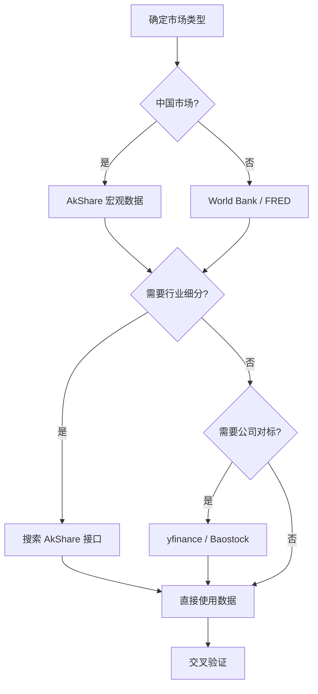

# 数据源使用指南

Market Sizing Skill V2 集成的免费数据源及使用说明。

---

## 快速参考

| 数据源 | 用途 | Python 库 | API Key |
|--------|------|-----------|---------|
| **AkShare** | 中国金融+宏观 | `akshare` | ❌ 不需要 |
| **FRED** | 美国宏观经济 | `fredapi` | ✅ 免费注册 |
| **World Bank** | 全球200+国家 | `wbdata` | ❌ 不需要 |
| **Baostock** | A 股历史数据 | `baostock` | ❌ 不需要 |
| **yfinance** | 全球上市公司 | `yfinance` | ❌ 不需要 |
| **pytrends** | Google 搜索趋势 | `pytrends` | ❌ 不需要 |

---

## 1. AkShare (中国数据首选)

AkShare 是目前最全面的中国金融数据接口，**1000+ 接口完全免费**。

### 安装
```bash
pip install akshare
```

### 常用接口

#### 宏观经济
```python
import akshare as ak

# GDP
gdp = ak.macro_china_gdp()

# CPI
cpi = ak.macro_china_cpi()

# PMI
pmi = ak.macro_china_pmi()

# 货币供应量 M2
money = ak.macro_china_supply_of_money()

# 社会消费品零售
retail = ak.macro_china_consumer_goods_retail()
```

#### 行业数据
```python
# 汽车销量
auto = ak.car_cpca_energy_sale()

# 房地产销售
property_sales = ak.macro_china_real_estate()

# 电力数据
power = ak.macro_china_ppi_yearly()
```

#### 搜索函数
```python
# 不知道用什么接口？搜索一下
funcs = [f for f in dir(ak) if 'gdp' in f.lower()]
print(funcs)
```

---

## 2. FRED (美国宏观经济)

Federal Reserve Economic Data，美联储官方数据。

### 获取 API Key (免费)
1. 访问 https://fred.stlouisfed.org/
2. 注册账号
3. My Account → API Keys → Request API Key
4. 设置环境变量:
   ```bash
   # Windows
   set FRED_API_KEY=your_key_here
   
   # Linux/Mac
   export FRED_API_KEY=your_key_here
   ```

### 使用
```python
from fredapi import Fred
import os

fred = Fred(api_key=os.getenv("FRED_API_KEY"))

# 联邦基金利率
fed_rate = fred.get_series("FEDFUNDS")

# 美国 GDP
gdp = fred.get_series("GDP")

# CPI
cpi = fred.get_series("CPIAUCSL")

# 失业率
unemployment = fred.get_series("UNRATE")
```

### 常用序列 ID
| 序列 ID | 指标 |
|---------|------|
| GDP | 美国 GDP |
| FEDFUNDS | 联邦基金利率 |
| CPIAUCSL | CPI 指数 |
| UNRATE | 失业率 |
| M2SL | M2 货币供应 |
| DGS10 | 10年期国债收益率 |

---

## 3. World Bank (全球宏观数据)

覆盖 200+ 国家，数据权威。

### 安装
```bash
pip install wbdata
```

### 使用
```python
import wbdata

# 中国 GDP
gdp = wbdata.get_dataframe(
    {"NY.GDP.MKTP.CD": "GDP"}, 
    country="CN"
)

# 多国对比
gdp_compare = wbdata.get_dataframe(
    {"NY.GDP.MKTP.CD": "GDP"}, 
    country=["CN", "US", "JP"]
)
```

### 常用指标代码
| 指标代码 | 说明 |
|----------|------|
| NY.GDP.MKTP.CD | GDP (美元) |
| NY.GDP.PCAP.CD | 人均 GDP |
| SP.POP.TOTL | 总人口 |
| FP.CPI.TOTL.ZG | 通胀率 |
| NE.EXP.GNFS.ZS | 出口占 GDP 比例 |

---

## 4. Baostock (A 股数据)

免费的 A 股历史数据，支持分钟级。

### 安装
```bash
pip install baostock
```

### 使用
```python
import baostock as bs

# 登录
bs.login()

# 获取日线数据
rs = bs.query_history_k_data_plus(
    "sh.600000",  # 浦发银行
    "date,open,high,low,close,volume",
    start_date="2024-01-01",
    frequency="d"
)

# 转为 DataFrame
import pandas as pd
data_list = []
while rs.next():
    data_list.append(rs.get_row_data())
df = pd.DataFrame(data_list, columns=rs.fields)

# 登出
bs.logout()
```

---

## 5. yfinance (全球上市公司)

Yahoo Finance 数据，无需 API Key。

### 安装
```bash
pip install yfinance
```

### 使用
```python
import yfinance as yf

# 获取公司信息
apple = yf.Ticker("AAPL")
print(apple.info["marketCap"])
print(apple.info["totalRevenue"])

# 历史股价
hist = apple.history(period="1y")

# 财务报表
income = apple.income_stmt
balance = apple.balance_sheet
cashflow = apple.cashflow
```

---

## 6. pytrends (Google 搜索趋势)

分析搜索热度变化。

### 安装
```bash
pip install pytrends
```

### 使用
```python
from pytrends.request import TrendReq

pytrends = TrendReq(hl='zh-CN', tz=480)

# 单个关键词
pytrends.build_payload(["通用航空"], geo="CN", timeframe="today 12-m")
trend = pytrends.interest_over_time()

# 对比多个关键词
pytrends.build_payload(["电动汽车", "燃油车"], geo="CN")
compare = pytrends.interest_over_time()
```

---

## 推荐工作流程


