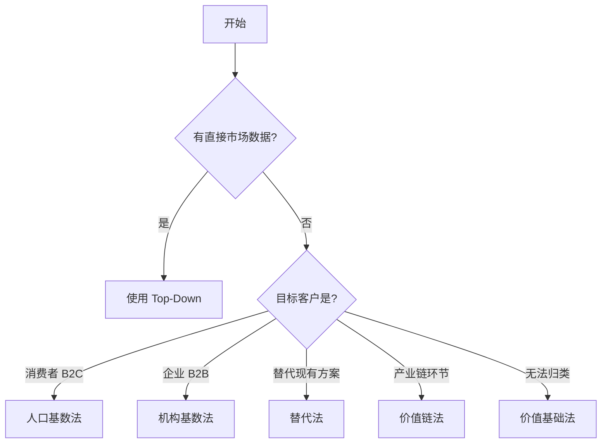

# Fermi 分解模式库

市场规模估算的 5 种标准 Fermi 分解模式。选择合适的模式取决于**可获取的数据类型**。

---

## ⚙️ 分解深度指南

一般情况下，Fermi 分解应做到 **3-5 层**。但不要为了追求层数而硬凑，以下是判断标准：

### 需要 4-5 层深度的场景
- 消费市场**城市层级差异显著** (一二三线消费力差 3-5 倍)
- 目标客户**不是同质化人群** (如不同行业的企业 IT 支出差异大)
- 投资人/决策者需要看到**可验证的细分假设**
- 市场是**新兴品类**，没有现成报告可引用

### 2-3 层即够的场景
- 市场已有**权威第三方报告**直接给出 TAM，Bottom-Up 只做验证
- 分解维度之间**差异不大** (如目标客户高度同质化)
- 只是做**快速量级判断** (order of magnitude)，不需要精确细分
- **替代法/价值链法**本身结构简单，2-3 步足够

### 分解深度检查
> ⚠️ 如果你的分解只有 2 层且数字直接来自 "行业常识"，请考虑再拆一层。
> 但如果第 4 层的数据只能靠猜，不如在第 3 层给出合理范围 (用 Monte Carlo)。

---

## 1. 人口基数法 (Population-Based)

**适用场景**: B2C 消费市场

**公式**:
```
市场规模 = 总人口 × 筛选率₁ × 筛选率₂ × ... × 渗透率 × 客单价 × 频率
```

### 示例: 中国咖啡市场 (咨询级 4 层分解)

**需求侧分解**:
```
L1: 14亿总人口
L2: × 65% 城镇化率 = 9.1亿城市人口
L3: × 50% 15-59岁核心消费年龄 = 4.55亿

L4: 按城市层级分层计算 (关键一步):
┌──────────────┬────────┬────────┬──────────┬──────────┐
│ 城市层级      │ 人口   │ 渗透率  │ 客单价   │ 年消费次数│
├──────────────┼────────┼────────┼──────────┼──────────┤
│ 一线 (4城)    │ 0.8亿  │ 40%    │ ¥35      │ 200      │
│ 新一线 (15城) │ 1.2亿  │ 25%    │ ¥28      │ 120      │
│ 二线 (30城)   │ 1.2亿  │ 15%    │ ¥22      │ 80       │
│ 三线及以下    │ 1.35亿 │ 5%     │ ¥18      │ 40       │
└──────────────┴────────┴────────┴──────────┴──────────┘

一线: 0.8亿 × 40% × ¥35 × 200 = ¥2240亿
新一线: 1.2亿 × 25% × ¥28 × 120 = ¥1008亿
二线: 1.2亿 × 15% × ¥22 × 80 = ¥317亿
三线+: 1.35亿 × 5% × ¥18 × 40 = ¥49亿

= ¥3614亿/年 需求侧 TAM
```

**供给侧交叉验证** (必做):
```
中国咖啡门店数: ~18万家 (来源: 窄门餐眼)
× 单店日均杯数: ~200杯
× 杯均价: ¥25
× 365天
= ¥3285亿/年

偏差: (3614-3285)/3285 = 10% → 合理范围
```

**逐假设 Sanity Check**:
| 假设 | 数值 | 验证方式 | 合理性 |
|------|------|----------|--------|
| 一线渗透率 40% | 对标日韩 60%+ | 中国增长期，合理 | ✅ |
| 三线渗透率 5% | 蜜雪冰城渠道下沉 | 可能偏低，保守合理 | ✅ |
| 一线客单价 ¥35 | Manner ¥15 vs 星巴克 ¥40 | 加权合理 | ✅ |
| 一线年消费 200 次 | ~4次/周 | 对标上海白领略高 | ⚠️ |

**关键假设来源**:
- 总人口: 国家统计局 (2024)
- 城镇化率: 国家统计局 65.22%
- 城市分级人口: 第一财经·新一线城市研究所
- 渗透率: 美团/大众点评行业报告 + 专家估计
- 门店数: 窄门餐眼 / 极海品牌监测

---

## 2. 机构基数法 (Institution-Based)

**适用场景**: B2B 企业服务市场

**公式**:
```
市场规模 = 目标机构数 × 采用率 × 每机构用量 × 单价
```

### 示例: 中国 HR SaaS 市场 (4 层分解)

```
L1: 中国企业总数 (来源: 市场监管总局)
    规模以上企业 (100人+): ~50万家
    中型企业 (50-100人): ~80万家
    小型企业 (10-50人): ~400万家

L2: 按行业筛选需要 HR SaaS 的行业:
    科技/互联网: 占 15% → 高需求
    金融/专业服务: 占 10% → 高需求
    制造业: 占 25% → 中需求
    零售/服务: 占 20% → 低需求
    其他: 占 30% → 低需求

L3: 按企业规模分层计算:
┌──────────┬───────┬────────┬─────────┬──────────┐
│ 企业规模  │ 数量   │ 渗透率  │ 坐席数   │ 年坐席费  │
├──────────┼───────┼────────┼─────────┼──────────┤
│ 500人+   │ 10万家 │ 40%    │ 50坐席   │ ¥800/坐席│
│ 100-500人│ 40万家 │ 25%    │ 15坐席   │ ¥600/坐席│
│ 50-100人 │ 80万家 │ 10%    │ 5坐席    │ ¥400/坐席│
└──────────┴───────┴────────┴─────────┴──────────┘

L4: 分层相乘:
    大型: 10万 × 40% × 50 × ¥800 × 12月 = ¥192亿
    中型: 40万 × 25% × 15 × ¥600 × 12月 = ¥108亿
    小型: 80万 × 10% × 5 × ¥400 × 12月 = ¥19.2亿

= ¥319亿/年 TAM
```

**交叉验证**: 与北森、薪人薪事等头部公司公开营收加总 × 市占率反推

**关键假设来源**:
- 企业数量: 市场监管总局 + 天眼查
- 渗透率: 艾瑞/甲子光年行业报告
- 坐席定价: 竞品官网定价 (北森、薪人薪事、飞书 People)

---

## 3. 替代法 (Substitution-Based)

**适用场景**: 新产品替代现有解决方案

**公式**:
```
市场规模 = 现有市场规模 × 替代率 × 价格系数
```

### 示例: 电动汽车替代燃油车 (分段替代)

> 注意：替代法通常 2-3 层即可，因为起点是**已知的现有市场规模**，不需要从人口拆起。

```
L1: 中国乘用车市场 ¥3.2万亿 (来源: 中汽协 2024)

L2: 按细分市场估计替代率:
┌──────────┬─────────┬──────────┬──────────┐
│ 细分市场  │ 占比     │ 5年替代率 │ 价格系数  │
├──────────┼─────────┼──────────┼──────────┤
│ 10万以下  │ 30%     │ 50%      │ 1.0x     │
│ 10-25万   │ 40%     │ 35%      │ 1.1x     │
│ 25万以上  │ 30%     │ 20%      │ 1.3x     │
└──────────┴─────────┴──────────┴──────────┘

L3: 分段计算:
    低端: 3.2万亿 × 30% × 50% × 1.0 = ¥4800亿
    中端: 3.2万亿 × 40% × 35% × 1.1 = ¥4928亿
    高端: 3.2万亿 × 30% × 20% × 1.3 = ¥2496亿

= ¥1.22万亿 电动车 TAM
```

**关键假设来源**:
- 现有市场: 中汽协年度数据
- 替代率: 参考挪威/荷兰渗透曲线，结合中国政策推演
- 价格系数: 对标同级别热销车型 (比亚迪 vs 同价位燃油车)

---

## 4. 价值链法 (Value-Chain-Based)

**适用场景**: 产业链中某个环节

**公式**:
```
市场规模 = 终端市场规模 × 该环节价值占比
```

> 注意：价值链法结构简单，通常 2-3 层即可。深度主要体现在**价值占比的精细拆解**上。

### 示例: 中国智能座舱市场 (3 层 BOM 分析)

```
L1: 中国乘用车市场 ¥3.2万亿 (来源: 中汽协)

L2: 座舱系统价值占比拆解:
    整车 BOM 中座舱占比: ~5%
    其中智能化部分 (电动调节/加热/记忆): 占座舱成本 40%

L3: 计算:
    3.2万亿 × 5% × 40% = ¥640亿 智能座舱组件 TAM

交叉验证:
    年产2500万辆 × 智能座舱配装率 50% × 单车智能座舱成本 ¥5000
    = 2500万 × 50% × ¥5000 = ¥625亿
    偏差: ~2% → 非常匹配
```

**关键假设来源**:
- 终端市场: 中汽协年度报告
- BOM 占比: 产业链拆机报告 (UBS Evidence Lab、IHS Markit)
- 配装率: 盖世汽车/乘联会数据

---

## 5. 价值基础法 (Value-Based)

**适用场景**: 无直接市场数据，从解决问题的价值反推

**公式**:
```
市场规模 = 目标客户数 × 问题频率 × 问题成本 × 愿付比例
```

### 示例: AI 代码审查市场 (4 层价值分解)

```
L1: 目标客户基数
    全球软件开发者: 2800万 (来源: Evans Data)
    其中企业开发者 (~60%): 1680万

L2: 问题成本量化
    平均每个开发者每年 Bug 修复时间: ~200小时
    企业开发者时薪: ~$60/小时 (全球加权平均)
    单人 Bug 成本: 200 × $60 = $12,000/年

L3: 问题总规模
    1680万 × $12,000 = $2016亿

L4: 愿付比例 (AI 审查可减少 30% Bug，企业愿意支付节省的 20%)
    $2016亿 × 30% × 20% = $121亿

= $121亿/年 TAM
```

**Sanity Check**: GitHub Copilot 年收入 ~$2亿，全球市占 <2% → TAM $121亿合理

**关键假设来源**:
- 开发者数量: Evans Data Corp / StackOverflow Survey
- Bug 时间: Stripe Developer Coefficient Report
- 时薪: Glassdoor 加权平均
- 愿付比例: 参考 SaaS 定价研究 (10-30% of value)

---

## 方法选择指南



---

## MECE 原则检查清单

在分解时，确保每一层筛选都符合 **MECE** (Mutually Exclusive, Collectively Exhaustive):

- [ ] **互斥**: 各子类别之间没有重叠
- [ ] **穷尽**: 所有子类别加起来等于全集
- [ ] **可量化**: 每个筛选条件都有数据支撑
- [ ] **合理**: 筛选顺序符合逻辑

**反例** ❌:
```
总人口
× 城市居民 (65%)
× 高收入人群 (20%)  ← 与城市居民有重叠
```

**正例** ✅:
```
总人口
× 城市人口 (65%)
× 20-50岁 (45%)
× 年收入>10万 (30%)  ← 在已筛选人群中的占比
```
