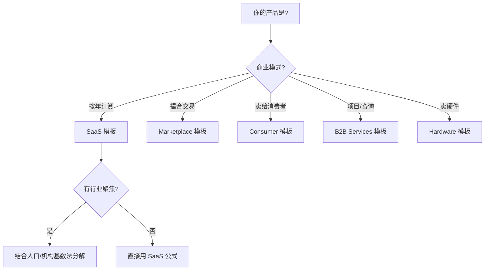

# 行业特化市场测算模板

不同行业有各自的核心 KPI 和估算公式。选择对应行业模板可以确保使用正确的度量方式。

---

## 1. SaaS (软件即服务)

**核心 KPI**: ACV (年合同价值)、Expansion Rate (扩展率)

**公式**:
```
TAM = 目标企业数 × 平均 ACV × (1 + 年扩展率)
SAM = TAM × 地域可服务占比 × 产品覆盖占比
SOM = SAM × 3-5 年内可实现市占率 (新进入者通常 2-5%)
```

**分层计算表**:
```
┌──────────┬───────┬────────┬──────────┐
│ 企业规模  │ 数量   │ 平均ACV │ 扩展率   │
├──────────┼───────┼────────┼──────────┤
│ 大企业    │ X万家  │ ¥Y万    │ 30%+    │
│ 中企业    │ X万家  │ ¥Y万    │ 15-20%  │
│ 小企业    │ X万家  │ ¥Y万    │ 5-10%   │
└──────────┴───────┴────────┴──────────┘
```

**关键注意**:
- SaaS 的 TAM 必须基于**年度经常性收入 (ARR)**，不是一次性收入
- Expansion Rate 包含 upsell + cross-sell，大型企业通常 >20%
- ICP (理想客户画像) 要明确，不是所有企业都是目标客户

**参考数据源**: 甲子光年、艾瑞咨询、Gartner、IDC

---

## 2. Marketplace (平台型)

**核心 KPI**: GMV (交易总额)、Take Rate (平台佣金率)

**公式**:
```
TAM = 品类 GMV 总规模 × 线上化率
平台收入 TAM = TAM × 行业平均 Take Rate
SAM = 平台收入 TAM × 目标品类占比 × 地域占比
SOM = SAM × 可实现市占率
```

**不同品类 Take Rate 参考**:
```
┌──────────────┬────────────┬──────────────┐
│ 平台类型      │ Take Rate  │ 代表企业      │
├──────────────┼────────────┼──────────────┤
│ 实物电商      │ 3-15%      │ 淘宝、拼多多   │
│ 外卖/到家     │ 15-25%     │ 美团、饿了么   │
│ 出行          │ 20-30%     │ 滴滴、Uber    │
│ 房产          │ 1-3%       │ 贝壳、链家     │
│ SaaS 交易市场 │ 15-30%     │ Salesforce    │
│ 知识/内容     │ 10-30%     │ 得到、小红书   │
└──────────────┴────────────┴──────────────┘
```

**关键注意**:
- GMV ≠ 收入，必须乘以 Take Rate
- 注意双边网络效应对 SOM 的影响 (赢者通吃)
- 多边平台需计算每一侧的价值

**参考数据源**: 公司年报/招股书、易观分析、QuestMobile

---

## 3. Consumer (消费品/应用)

**核心 KPI**: MAU/DAU、ARPU (人均收入)、购买频率

**公式**:
```
TAM = 目标用户总量 × 年 ARPU
SAM = TAM × 产品适配率 × 地域可服务率
SOM = SAM × 可实现渗透率
```

**用户量化框架**:
```
┌──────────────┬────────┬────────┬────────┐
│ 用户层级      │ 数量   │ ARPU   │ 活跃度  │
├──────────────┼────────┼────────┼────────┤
│ 核心用户      │ X      │ ¥高     │ 日活   │
│ 活跃用户      │ X      │ ¥中     │ 周活   │
│ 边缘用户      │ X      │ ¥低     │ 月活   │
└──────────────┴────────┴────────┴────────┘
```

**不同消费品类的 ARPU 思路**:
- **快消品**: 客单价 × 购买频率/年
- **耐用品**: 客单价 × 替换周期倒数 (如手机 ¥5000 × 1/3年)
- **订阅制**: 月费 × 12 × 留存率
- **免费增值**: 付费转化率 × 付费用户 ARPU

**关键注意**:
- 消费品 TAM 需要区分**支出口径** vs **零售口径** (含渠道加价)
- 用户分层时必须反映消费力差异 (一二线 vs 下沉市场)
- 频率假设直接影响 TAM 量级，必须有数据支撑

**参考数据源**: 国家统计局消费数据、QuestMobile、Euromonitor

---

## 4. B2B Services (企业服务)

**核心 KPI**: 目标企业数、平均项目金额、复购频率

**公式**:
```
TAM = 目标企业数 × 平均项目金额 × 年均项目频率
SAM = TAM × 可服务行业占比 × 企业规模匹配率
SOM = SAM × 可实现渗透率
```

**分层计算框架**:
```
┌──────────┬───────┬──────────┬───────────┐
│ 客户层级  │ 数量   │ 项目金额  │ 年频率     │
├──────────┼───────┼──────────┼───────────┤
│ 大客户    │ X     │ ¥百万级   │ 2-4次/年  │
│ 中客户    │ X     │ ¥十万级   │ 1-2次/年  │
│ 小客户    │ X     │ ¥万级     │ 1次/年    │
└──────────┴───────┴──────────┴───────────┘
```

**关键注意**:
- B2B 的 SOM 受**销售团队规模**和**交付能力**强约束
- 项目制 vs 订阅制收入模式差异巨大
- 大客户虽少但贡献可能占 70%+ (二八法则)

**参考数据源**: 天眼查企业数据库、LinkedIn Talent Insights、行业协会

---

## 5. Hardware / IoT (硬件/物联网)

**核心 KPI**: 出货量、ASP (平均售价)、替换周期

**公式**:
```
TAM = 年出货量 × ASP
  或: 保有量 × ASP ÷ 平均替换周期
SAM = TAM × 目标市场段占比
SOM = SAM × 可实现市占率
```

**关键注意**:
- 硬件市场需要区分**增量市场** (新增) 和**存量替换市场**
- ASP 随产品生命周期下降 (学习曲线效应)
- 需考虑生态/配件收入 (如打印机 + 墨盒模式)

**参考数据源**: IDC、Canalys、Counterpoint Research

---

## 行业选择速查


